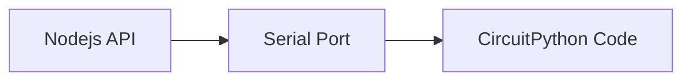

# Tools to get Kubernetes State Visible Physically

## Summary

## Hardware

## Software

# Indicator Hardware
The [Adafruit Neo Trinkey](https://www.adafruit.com/product/4870) is the base hardware that's used for showing status.  It has 4 RGB LEDs that can be easily programmed.

The [CircuitPython Firmware](https://circuitpython.org/board/neopixel_trinkey_m0/) is easily flashed to the device. Once flashed, a 
few [CircuitPython libraries](https://circuitpython.org/libraries) need to be copied to the lib folder and 
the [CircuitPython Code](https://github.com/freemansoft/Adafruit-Trinkey-CircuitPython/tree/main/Indicator-Light-neopixel) can be copied to the CIRCUITPY drive.

